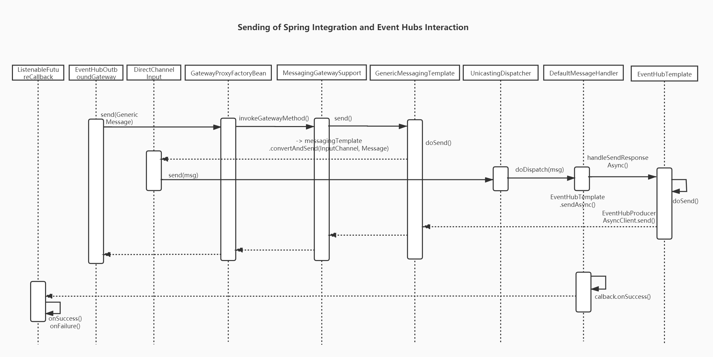
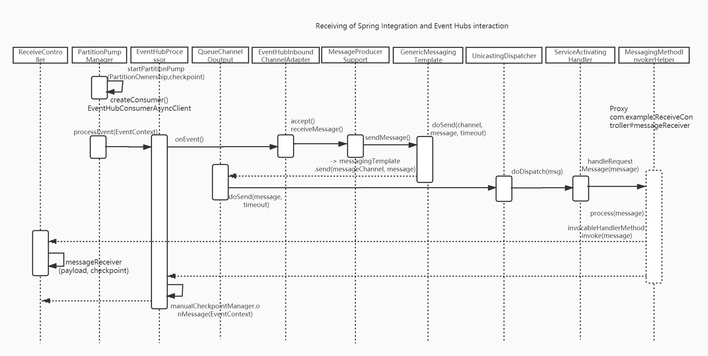

[[_TOC_]]

# How to integrate Azure Event Hubs with Spring Integration

## Azure Event Hubs introduction

Azure Event Hubs is a big data streaming platform and event ingestion service. It can receive and process millions of events per second. 
Data sent to an event hub can be transformed and stored by using any real-time analytics provider or batching/storage adapters.


### Key features of Azure Event Hubs
* Fully managed PaaS
<p>little configuration or management overhead.</p>

* Support for real-time and batch processing
<p>
Ingest, buffer, store, and process your stream in real time to get actionable insights. Event Hubs uses a partitioned consumer model, 
enabling multiple applications to process the stream concurrently and letting you control the speed of processing.
</p>

* Scalable(Auto-inflate)
<p>Automatically expand the number of throughput units to meet your usage needs.</p>

* Rich ecosystem(Kafka)
<p>
Event Hubs for Apache Kafka ecosystems enables Apache Kafka (1.0 and later) clients and applications to talk to Event Hubs. You do 
not need to set up, configure, and manage your own Kafka clusters. 
Multi-language interface support(.NET, Java, Python, JavaScript).
</p>

## Integrate Event Hubs with Spring Integration
There are three ways to enable interaction with Azure Event Hubs.

* spring-cloud-starter-azure-eventhubs
* spring-cloud-azure-eventhubs-stream-binder
<br/>
Mainly depends on spring-cloud-starter-azure-eventhubs and azure-messaging-eventhubs-checkpointstore-blob.
* spring-cloud-starter-azure-eventhubs-kafka
<br/>
Mainly depends on spring-cloud-stream-binder-kafka.

Mainly introduce spring-cloud-starter-azure-eventhubs component. Next, let's see how this component interacts with Event Hubs.

## 1 Properties Configuration(Connection string based usage)

```properties
# Fill event hub namespace connection string copied from portal, this is the main credential to link Azure Event Hubs.
spring.cloud.azure.eventhub.connection-string=XXX

# The folowing three configuration information is mainly used to configure checkpoint authentication information and storage location
spring.cloud.azure.eventhub.checkpoint-access-key=XXX
spring.cloud.azure.eventhub.checkpoint-storage-account=XXX
spring.cloud.azure.eventhub.checkpoint-container=XXX
```

<br/>

</b>*
#### Supplementary explanation
Checkpointing is a process by which readers mark or commit their position within 
a partition event sequence. Checkpointing is the responsibility of the consumer 
and occurs on a per-partition basis within a consumer group. This responsibility 
means that for each consumer group, each partition reader must keep track of its 
current position in the event stream, and can inform the service when it considers 
the data stream complete.
</b>*

## 2 POM Configuration
Add component dependency.
```xml
    <dependency>
        <groupId>com.microsoft.azure</groupId>
        <artifactId>spring-cloud-starter-azure-eventhubs</artifactId>
    </dependency>
```

## 3 Bean Configuration

Only focus on Event Hubs configuration, after all related beans are initialized, it means the client has passed the authentication and authorization to access Azure Event Hubs.

### 3.1 Involving Annotation
Use annotation @EnableIntegration on Spring startup class.

Since we depend on the <b> spring-cloud-starter-azure-eventhubs</b> package, we will eventually depend on the spring-integration-code module, so this annotation @EnableIntegration can be automatically turned on.

### 3.2 Modules automatically dependent on POM 

#### Module spring-boot-autoconfigure
<table>
    <tr>
    <td>Class Name</td><td>Mainly related beans</td>
    </tr>
    <tr>
        <td>IntegrationAutoConfiguration</td><td>
        <ol>
        <li><b>IntegrationConfiguration</b>
        <br/>
        This static class enables @EnableIntegration annotation function.
        </li>
        <li><b>IntegrationJmxConfiguration</b>
        <br/>
        Spring Integration JMX configuration.
        </li>
        <li><b>IntegrationManagementConfiguration</b>
        <br/>
        This static class enables @EnableIntegrationManagement annotation function.
        </li>
        <li><b>IntegrationComponentScanConfiguration</b>
        <br/>
        This static class enables @IntegrationComponentScan annotation function.
        </li>
        </ol>
        </td>
    </tr>
    <tr>
        <td>IntegrationRegistrar</td>
        <td>
        <ol>
            <li><b>ChannelInitializer</b><br/>
            It's responsible for creating channels that are not explicitly defined but identified via the 'input-channel' attribute of the corresponding endpoints.
            This bean plays a role of pre-instantiator since it is instantiated and initialized as the very first bean of all SI beans.
            </li>
            <li><b>ChannelInitializer.AutoCreateCandidatesCollector.class</b>
            <br/>
            Collects candidate channel names to be auto-created by ChannelInitializer.
            </li>
            <li><b>DefaultConfiguringBeanFactoryPostProcessor</b>
            <br/>
            A BeanFactoryPostProcessor implementation that registers bean definitions for many infrastructure components with their default configurations. All of them can be overridden using particular bean names.
            </li>
            <li><b>IntegrationConfigurationBeanFactoryPostProcessor</b>
            <br/>
            A BeanDefinitionRegistryPostProcessor implementation that applys external Integration infrastructure configurations via loading IntegrationConfigurationInitializer implementations using SpringFactoriesLoader.
            </li>
            <li><b>MessagingAnnotationPostProcessor</b>
            <br/>
            A BeanPostProcessor implementation that processes method-level messaging annotations such as @Transformer, @Splitter, @Router, and @Filter.
            </li>
        </ol>
        </td>
    </tr>
</table>

#### Module spring-cloud-azure-autoconfigure
Only focus on Event Hubs configuration.
<table>
    <tr>
    <td>Class Name</td><td>Mainly related beans</td>
    </tr>
    <tr>
        <td>AzureEnvironmentAutoConfiguration</td><td>
        <ol>
        <li><b>EnvironmentProvider</b>
        <br/>
        This bean depends on bean AzureProperties, it provides credential file and client configuration information.
        </li>
        </ol>
        </td>
    </tr>
    <tr>
        <td>AzureContextAutoConfiguration</td>
        <td>
        <ol>
            <li><b>AzureProperties</b><br/>
            Properties configuration for credential file based usage, like credentialFile, resourceGroup, etc. 
            </li>
            <li><b>ResourceManagerProvider</b>
            <br/>
            Endpoints for accessing resource services APIs, it focuses on the interface of the upper layer application, but bottom layer still depends on the Azure resource manager.
            </li>
            <li><b>Azure</b>
            <br/>
            Azure class encapsulates all available resource management, 
            each resource manager has a corresponding resource management APIs which are underlying interface, mainly uses EventHubManager, StorageManager, Authenticated.
            </li>
            <li><b>AzureTokenCredentials</b>
            <br/>
            Connect to Azure Event Hubs's credentials
            </li>
        </ol>
        </td>
    </tr>
    <tr>
    <td>AzureEventHubAutoConfiguration</td><td>
    <ol>
        <li><b>AzureEventHubProperties</b>
        <br/>
        Properties configuration for connection string based usage, like connect-string, checkpoint, etc. 
        </li>
        <li><b>EventHubOperation</b>
        <br/>
        Default implementation EventHubOperation, like sending, batch sending, and subscribing message operation.
        </li>
        <li><b>EventHubConnectionStringProvider</b>
        <br/>
        This bean depends on bean resourceManagerProvider, it provides connect-string configuration information.
        </li>
        <li><b>EventHubClientFactory</b>
        <br/>
        Bean EventHubClientFactory is responsible for providing instance of class <b>EventHubConsumerAsyncClient</b>(or EventHubProducerAsyncClient) which that can interact with entities of Event Hubs. 
        </li>
    </ol>
    </td>
    </tr>
</table>
 
## 4 The sample application configuration

<a href="https://github.com/microsoft/spring-cloud-azure/tree/master/spring-cloud-azure-samples/eventhubs-integration-sample">Here's demo code link.</a>

```java

@SpringBootApplication
@EnableIntegration // this can be omitted.
public class EventHubIntegrationApplication {

    public static void main(String[] args) {
        SpringApplication.run(EventHubIntegrationApplication.class, args);
    }
}
```

```java
@RestController
public class SendController {

    private static final String OUTPUT_CHANNEL = "output";
    private static final String EVENTHUB_NAME = "moary-event-hubs";

    @Autowired
    EventHubOutboundGateway messagingGateway;

    /** Message gateway binding with {@link MessageHandler}
     *  via {@link MessageChannel} has name {@value OUTPUT_CHANNEL}
     */
    @MessagingGateway(defaultRequestChannel = OUTPUT_CHANNEL)
    public interface EventHubOutboundGateway {
        void send(String text);
    }

    /**
     * Posts a message to a Azure Event Hub
     */
    @PostMapping("/messages")
    public String send(@RequestParam("message") String message) {
        this.messagingGateway.send(message);
        return message;
    }

    @Bean
    @ServiceActivator(inputChannel = OUTPUT_CHANNEL)
    public MessageHandler messageSender(EventHubOperation queueOperation) {
        DefaultMessageHandler handler = new DefaultMessageHandler(EVENTHUB_NAME, queueOperation);
        handler.setSendCallback(new ListenableFutureCallback<Void>() {
            @Override
            public void onSuccess(Void result) {
                System.out.println("Message was sent successfully.");
            }

            @Override
            public void onFailure(Throwable ex) {
                System.out.println("There was an error sending the message.");
            }
        });
        return handler;
    }
}
```

```java
@RestController
public class ReceiveController {

    private static final String INPUT_CHANNEL = "input";
    private static final String EVENTHUB_NAME = "moary-event-hubs";
    private static final String CONSUMER_GROUP = "moary-event-consumer-grp";

    /** This message receiver binding with {@link EventHubInboundChannelAdapter}
     *  via {@link MessageChannel} has name {@value INPUT_CHANNEL}
     */
    @ServiceActivator(inputChannel = INPUT_CHANNEL)
    public void messageReceiver(byte[] payload, @Header(AzureHeaders.CHECKPOINTER) Checkpointer checkpointer) {
        String message = new String(payload);
        System.out.println(String.format("New message received: '%s'", message));
        checkpointer.success()
                .doOnSuccess(s -> System.out.println(String.format("Message '%s' successfully checkpointed", message)))
                .doOnError(System.out::println)
                .subscribe();
    }

    @Bean
    public EventHubInboundChannelAdapter messageChannelAdapter(
            @Qualifier(INPUT_CHANNEL) MessageChannel inputChannel, EventHubOperation eventhubOperation) {
        eventhubOperation.setCheckpointConfig(CheckpointConfig.builder().checkpointMode(CheckpointMode.MANUAL).build());
        EventHubInboundChannelAdapter adapter = new EventHubInboundChannelAdapter(EVENTHUB_NAME,
                eventhubOperation, CONSUMER_GROUP);
        adapter.setOutputChannel(inputChannel);
        return adapter;
    }

    @Bean
    public MessageChannel input() {
        return new DirectChannel();
    }
}
```

## 5 How does it work?
Let's analyze the execution process of the above Demo. Sequence diagram shows the interaction of related classes and methods in the integration process.

### 5.1 Sending of Spring Integration and Event Hubs Interaction

<a href="https://www.processon.com/view/link/5ef87e181e085326374813b5">Link this file.</a>



### 5.2 Receiving of Spring Integration and Event Hubs Interaction

<a href="https://www.processon.com/view/link/5ef9ea121e085326374b395a">Link this file.</a>


