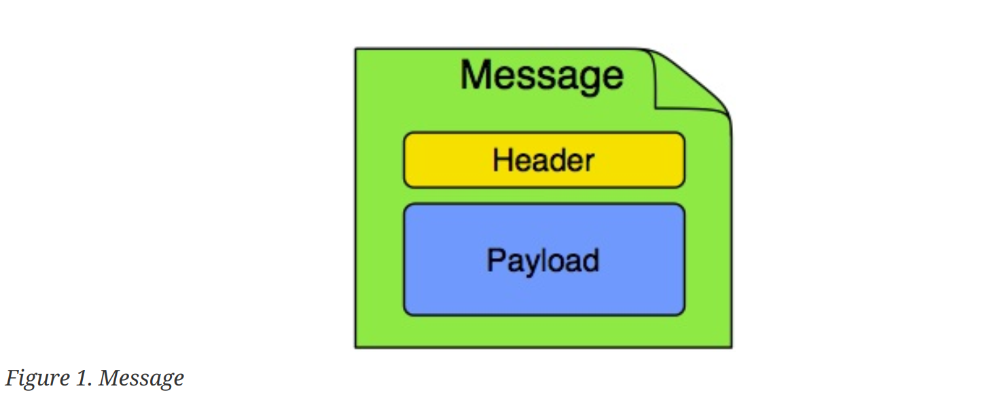
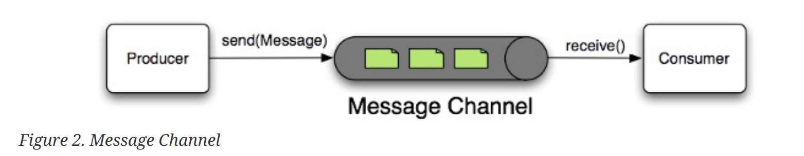
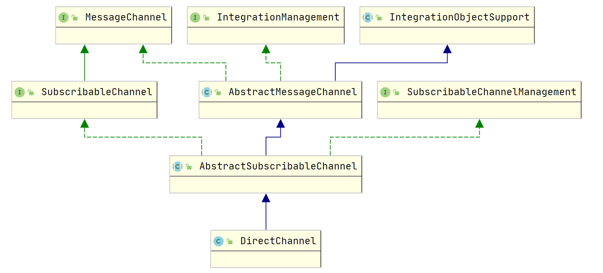
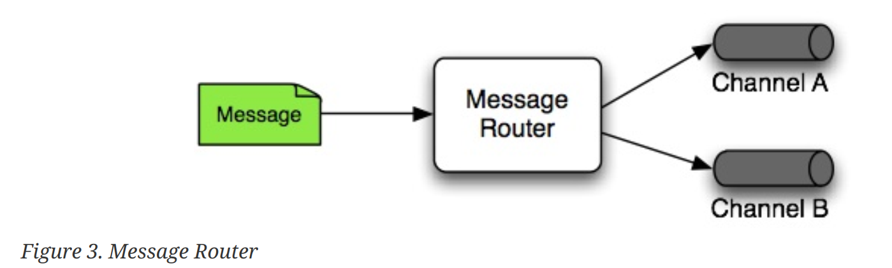
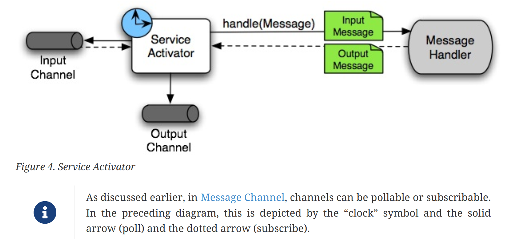
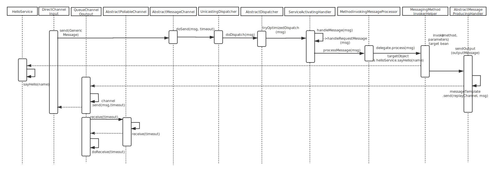
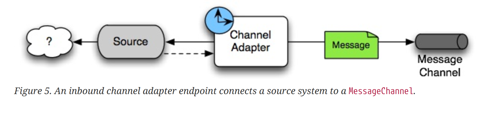
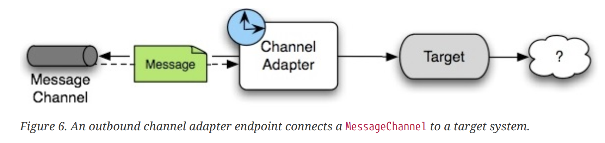
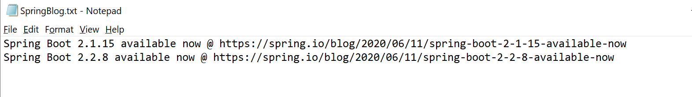

# Spring Integration Abstraction

## 1 Overview 
It enables lightweight messaging within Spring-based applications and supports integration with 
external systems through declarative adapters. Those adapters provide a higher level of abstraction 
over Spring’s support for remoting, messaging, and scheduling.

## 2 Main Components


### 2.1 Message
a message is a generic wrapper for any Java object combined with metadata
used by the framework while handling that object. It consists of a payload and headers.



The transmission model must be the implementation of interface Message, 
The following class GenericMessage is the default message model for transmission. 

```java

public interface Message<T> {

	/**
	 * Return the message payload.
	 */
	T getPayload();

	/**
	 * Return message headers for the message
	 */
	MessageHeaders getHeaders();

}

public class GenericMessage<T> implements Message<T>, Serializable {

	private final T payload;

	private final MessageHeaders headers;

}
```

### 2.2 Message Channel 
A message channel represents the “pipe” of a pipes-and-filters architecture. Producers send
messages to a channel, and consumers receive messages from a channel. The message channel
therefore decouples the messaging components and also provides a convenient point for
interception and monitoring of messages.


<p>
Spring Integration provides many implementations of MessageChannel, will introduce Channel 
DirectChannel.
</p>
<p>
The DirectChannel has point-to-point semantics but otherwise is more similar to the
PublishSubscribeChannel than any of the queue-based channel implementations described earlier. It  implements the SubscribableChannel interface instead of the PollableChannel interface, so it dispatches messages directly to a subscriber. As a point-to-point channel, however, it differs from the PublishSubscribeChannel in that it sends each Message to a single subscribed MessageHandler.
</p>

#### DirectChannel


##### Top Class:
```java
public interface MessageChannel {

	/**
	 * Send a {@link Message} to this channel. If the message is sent successfully,
	 * the method returns {@code true}. If the message cannot be sent due to a
	 * non-fatal reason, the method returns {@code false}. The method may also
	 * throw a RuntimeException in case of non-recoverable errors.
	 * <p>This method may block indefinitely, depending on the implementation.
	 * To provide a maximum wait time, use {@link #send(Message, long)}.
	 * @param message the message to send
	 * @return whether or not the message was sent
	 */
	default boolean send(Message<?> message) {
		return send(message, INDEFINITE_TIMEOUT);
	}

	/**
	 * Send a message, blocking until either the message is accepted or the
	 * specified timeout period elapses.
	 * @param message the message to send
	 * @param timeout the timeout in milliseconds or {@link #INDEFINITE_TIMEOUT}
	 * @return {@code true} if the message is sent, {@code false} if not
	 * including a timeout of an interrupt of the send
	 */
	boolean send(Message<?> message, long timeout);

}
```

### 2.3 Message Endpoint
Message endpoint will be implemented by Spring Integration, developer only need to provide 
the declarative configuration, Spring IoC will manage them, then you can connect your program to the message infrastructure 
provided by Spring Integration.
<p>
About the Message Endpoint, please see the introduction below:
</p>

#### 2.3.1 Message Transformer
A message transformer can manage the message object, including converting a message's content or structure, returning 
the modified message, header information can also be modified.
#### 2.3.2 Message Filter
A message filter determines whether a message should be passed to an output channel at all.
#### 2.3.3 Message Router
A message router is responsible for deciding what channel or channels (if any) should receive the
message next.


##### Top Class
**org.springframework.integration.gateway.GatewayProxyFactoryBean**
Developers only need to define the interface, Spring Integration will create a proxy implementation class for us, 
and the instances will be managed by the Spring IOc container.

#### 2.3.4 Message Splitter
A Message Splitter is to accept a message from its input channel, split that message into multiple message, and send each of 
those to its output channel.

##### Top Class
**org.springframework.integration.splitter.AbstractMessageSplitter**
<p>
Developers need to inherit class **AbstractMessageSplitter** and implement the splitMessage method.
</p>

```java
public abstract class AbstractMessageSplitter extends AbstractReplyProducingMessageHandler
		implements DiscardingMessageHandler {
    
    protected abstract Object splitMessage(Message<?> message);
}

```

#### 2.3.5 Aggregator
Basically a mirror-image of the splitter, the aggregator is a type of message endpoint that receives
multiple messages and combines them into a single message.

#### 2.3.6 Service Activator
A Service Activator is a generic endpoint for connecting a service instance to the messaging system.
The input message channel must be configured, and, if the service method to be invoked is capable 
of returning a value, an output message Channel may also be provided.


##### Top Class
**org.springframework.integration.config.xml.ServiceActivatorParser**
Class ServiceActivatorParser will parse out a BeanDefinition object via xml configuration, then 
Spring will create bean instance.

<p>
Similarly, the java annotation class is <b>org.springframework.integration.annotation.ServiceActivator</b>.
</p>

#### Knowing this, we can practice a small demo
```xml
<!-- file: helloWorldDemo.xml -->
<beans:beans>

	<channel id="inputChannel"/>
	<channel id="outputChannel">
		<queue capacity="10"/>
	</channel>
	<service-activator input-channel="inputChannel"
	                   output-channel="outputChannel"
	                   ref="helloService"
	                   method="sayHello"/>
	<beans:bean id="helloService" class="org.springframework.integration.samples.helloworld.HelloService"/>
</beans:beans>
```

```java
public class HelloService {

	public String sayHello(String name) {
		return "Hello " + name;
	}
}

public class HelloWorldApp {

	private static Log logger = LogFactory.getLog(HelloWorldApp.class);
	
	public static void main(String[] args) {
		AbstractApplicationContext context = new ClassPathXmlApplicationContext("helloWorldDemo.xml", HelloWorldApp.class);
		MessageChannel inputChannel = context.getBean("inputChannel", MessageChannel.class);
		// A MessageChannel from which messages may be actively received through polling.
		PollableChannel outputChannel = context.getBean("outputChannel", PollableChannel.class);
		inputChannel.send(new GenericMessage<String>("World"));
		logger.info("==> HelloWorldDemo: " + outputChannel.receive(0).getPayload());
		context.close();
	}
}
```

##### The following is the timing diagram of this Demo execution

<a href="https://www.processon.com/diagraming/5ef9b1b6f346fb1ae58411e3">Clone this file.</a>



#### 2.3.7 Channel Adapter
A channel adapter is an endpoint that connects a message channel to some other system or
transport. Channel adapters may be either inbound or outbound.Typically, the channel adapter does some mapping between 
the message and whatever object or resource is received from or sent to the other system (file, HTTP Request, 
JMS message, and others).




#### Knowing this, we can continue to practice a small demo
```xml
<!-- file: integration.xml -->
<beans:beans>
    
    <feed:inbound-channel-adapter id="news" url="https://spring.io/blog.atom" 
            auto-startup="${auto.startup:true}">
        <int:poller fixed-rate="5000"/>
    </feed:inbound-channel-adapter>

    <int:transformer
            input-channel="news"
            expression="payload.title + ' @ ' + payload.link + '#{systemProperties['line.separator']}'"
            output-channel="file"/>

    <file:outbound-channel-adapter id="file"
                                   mode="APPEND"
                                   charset="UTF-8"
                                   directory="C:\tmp\dat"
                                   filename-generator-expression="'${feed.file.name:SpringBlog}.txt'"/>
    
</beans>
```

##### Top Class
**org.springframework.integration.config.xml.AbstractPollingInboundChannelAdapterParser**
Spring Integration provides the top class **org.springframework.integration.config.xml.AbstractChannelAdapterParser**, and 
implementation class **FeedInboundChannelAdapterParser** and **FileInboundChannelAdapterParser** will parse the xml configuration, 
generate the bean instances to be controlled by Spring IoC container.

<p>
Similarly, the java annotation class is <b>org.springframework.integration.annotation.InboundChannelAdapter</b>.
</p>

```java
@SpringBootApplication
@ImportResource("integration.xml")
public class IntegrationApplication {
  public static void main(String[] args) throws Exception {
    ConfigurableApplicationContext ctx = new SpringApplication(IntegrationApplication.class).run(args);
    System.out.println("Hit Enter to terminate");
    System.in.read();
    ctx.close();
  }
}
```



## 3 Configuration
Introduce two configuration methods

### 3.1 Namespace Support
You can configure Spring Integration components with XML elements that map directly to the terminology and concepts of 
enterprise integration.
<p>
To enable Spring Integration’s core namespace support within your Spring configuration files, add the following namespace 
reference and schema mapping in your top-level 'beans' element:
</p>

```xml
<!-- file: integration.xml -->
<beans xmlns="http://www.springframework.org/schema/beans"
              xmlns:xsi="http://www.w3.org/2001/XMLSchema-instance"
              xmlns:int="http://www.springframework.org/schema/integration"
              xmlns:file="http://www.springframework.org/schema/integration/file"
              xmlns:feed="http://www.springframework.org/schema/integration/feed"
              xsi:schemaLocation="http://www.springframework.org/schema/integration/feed https://www.springframework.org/schema/integration/feed/spring-integration-feed.xsd
       		http://www.springframework.org/schema/beans https://www.springframework.org/schema/beans/spring-beans.xsd
       		http://www.springframework.org/schema/integration/file https://www.springframework.org/schema/integration/file/spring-integration-file.xsd
       		http://www.springframework.org/schema/integration https://www.springframework.org/schema/integration/spring-integration.xsd">
    
    .....
    
</beans>
```

### 3.2 Annotation Support
In addition to the XML namespace support for configuring message endpoints, you can also use
annotations.

* @Aggregator
* @Filter
* @Router
* @ServiceActivator
* @Splitter
* @Transformer
* @InboundChannelAdapter
* @BridgeFrom
* @BridgeTo
* @MessagingGateway
* @IntegrationComponentScan

Please refer [here](https://docs.spring.io/spring-integration/reference/html/configuration.html#annotations) for details.
